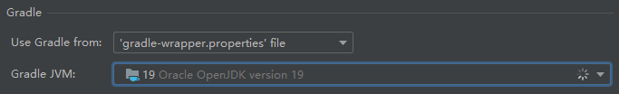
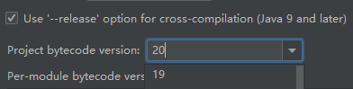

# Compiling Gradle Projects with Unsupported JDK Versions

_2023.02.26 squid233_

> **Note**
> You should never use an unsupported JDK version, unless you need to use.

I was trying to compile my project with JDK 20, then I got an error message “Unsupported class file major version 64”.

This article introduced how to compile a Gradle project with an unsupported JDK version.

## Step 1. Set JDK of Gradle

Perhaps you are using JDK 20 and Gradle 8.0.1, you will get the error as the beginning of this article.

You need to use a supported version, it can be the previous version of JDK 20 i.e. JDK 19.

You can simply set it at `Settings -> Build, Execution, Deployment -> Build Tools -> Gradle`:  

## Step 2. Set Bytecode Version

You also need to set the bytecode version.

As of the date this article written (2023.02.26), by default, there is no bytecode version 20, but we can set it
manually at `Settings -> Build, Execution, Deployment -> Compiler -> Java Compiler`.

You can even set it to another value like 420. I’m not sure what will happen if you do that.

## Step 3. Set Java Toolchain

Last, you need to set the Java toolchain. Add `org.gradle.java.installations.paths=path/to/jdk20` to your
gradle.properties. I suggest you to add it under your `GRADLE_USER_HOME` (defaults to `~/.gradle`).

## Step 4. Build

Now you should be able to build and publish your project.

You can also try our project
<a href="https://github.com/Over-Run/overrungl" target="_blank" rel="noreferrer noopener">OverrunGL</a>.
It is experimental, and we are glad to hear the feedback from you all.

