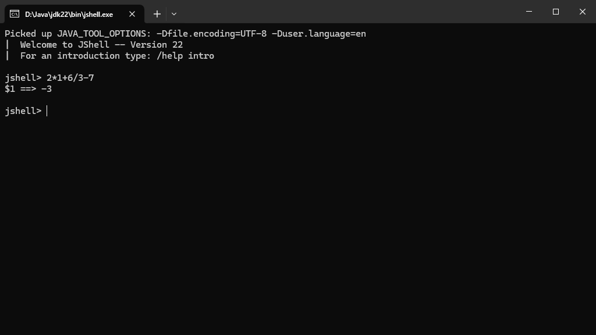

## 概念

**标识符**（Identifier）是指一个标记 Java 对象的名称。

**关键字**（Keyword）是指具有特别含义字母或字符。
其中，**保留字**（Reserved-keyword）不可作为标识符。
强行使用保留字会导致编译错误。

**字面量**（Literal）是指数字、字符和字符串，例如：`42`、`"Hello"`。

**操作符**（Operator）是指一种对 Java 对象执行特殊操作的符号。
常见的操作符有：
- `+`、`-`
- `*`：乘
- `/`：除以
- `&&`：逻辑与
- `||`：逻辑或
- `>`、`<`
- `>=`：大于或等于
- `<=`：小于或等于
- `==`：等于
- `.`：获取对象

**表达式**（Expression）是指由（部分）关键字、字面量、标识符与操作符组合成的式子。

JShell 支持执行表达式。例如，输入`2*1+6/3-7`：

